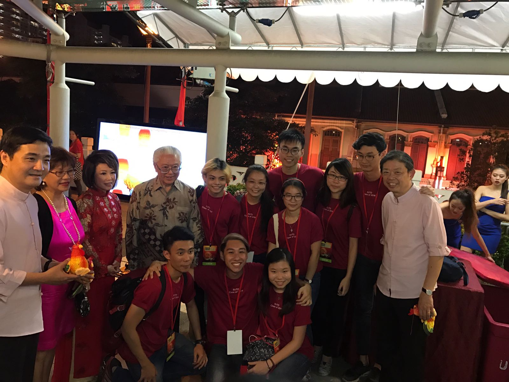

# Huat Greetings Wall

Interactive Wall for Chinatown New Year Festival 2017. This is part of SUTD contribution to Chinatown for Chinese New Year 2017.

Passer-by of the "Huat Greetings Wall" (giant LED display on Garden Bridge) can send in well-wishes from [Chinatown Festival Website](http://chinatownfestivals.sg/huatgreetings/). The wishes will then be screen on the Interactive Wall in form of lanterns floating up to the sky.

  We are honored to have a chance to present this project to Singapore President Tony Tan and also receive coverage from media.
   
  <a href="http://www.straitstimes.com/multimedia/photos/in-pictures-chinatown-lights-up-for-the-2017-chinese-new-year-celebrations" target="_blank">The Straits Times</a>
   
  <a href="http://www.todayonline.com/entertainment/largest-number-lanterns-and-car-boot-sale-tons-enjoy-chinatown-chinese-new-year" target="_blank">TODAY</a>
   
  <a href="https://www.familiesforlife.sg/unite-at-an-event/Pages/Chinatown-Chinese-New-Year-2017.aspx" target="_blank">Families For Life</a>

### 
