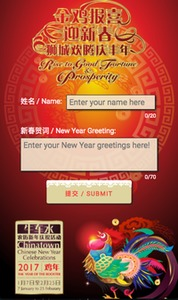
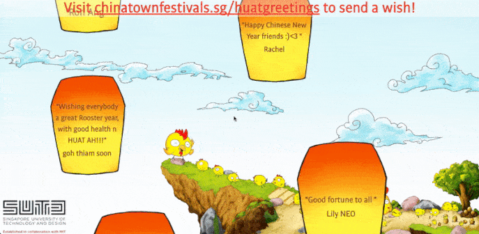
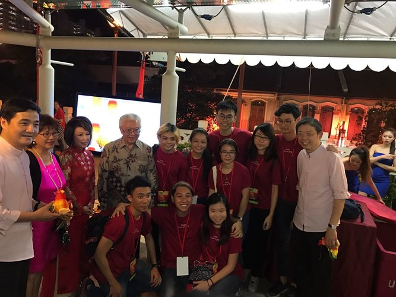

# Huat Greetings Wall

Interactive Wall for Chinatown New Year Festival 2017. This is part of SUTD contribution to Chinatown for Chinese New Year 2017.

Passer-by of the "Huat Greetings Wall" (giant LED display on Garden Bridge) can send in well-wishes from [Chinatown Festival Website](http://chinatownfestivals.sg/huatgreetings/). The wishes will then be screened on the Interactive Wall in form of lanterns floating up to the sky.

We are honored to have the chance to present this project to Singapore President Tony Tan and also receive coverage from media.
 
[The StraitsTimes](http://www.straitstimes.com/multimedia/photos/in-picures-chinatown-lights-up-for-the-2017-chinese-new-year-celerations)
 
[TODAY](http://www.todayonline.com/entertainment/largest-nuber-lanterns-and-car-boot-sale-tons-enjoy-chinatown-chinesenew-year)
 
[Families ForLife](https://www.familiesforlife.sg/unite-at-an-event/Page/Chinatown-Chinese-New-Year-2017.aspx)
 

### Team members

- Stanley Nguyen The Hung
- Gabriel Wong (@gabrielwong159)
- York Cheng
- And other Architecture students in the project 